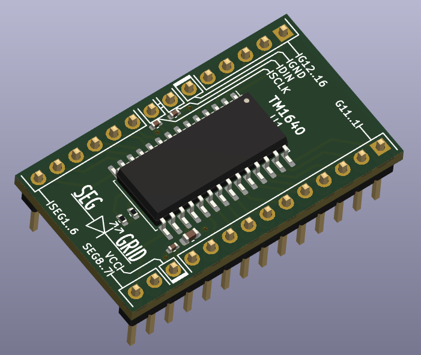

# TM1640 Breakout Board
A breakout board made for the chinese Titan Micro Electronics TM1640 chip, commonly used in cheap 7-segment displays.

The board has been designed mostly with size in mind to be able to plug it into a breadboard. It is 14x8 breadboard pins long (1.4x0.8in, or around 35.56x20.32mm). It follows the datasheet design (Using both a 10k pullup resistor and 100p capacitor for both data lines, and a 100nF as well as a 100uF capacitor for the VCC pin).

Contributions as well as criticism and suggestions are more than welcome.

